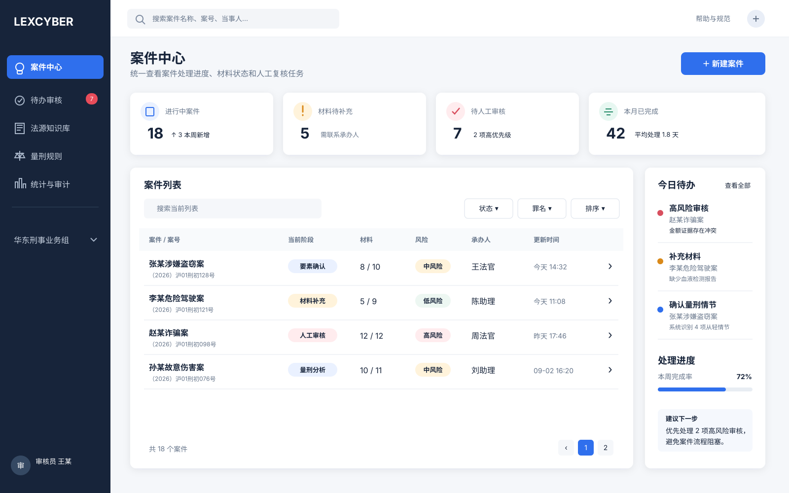
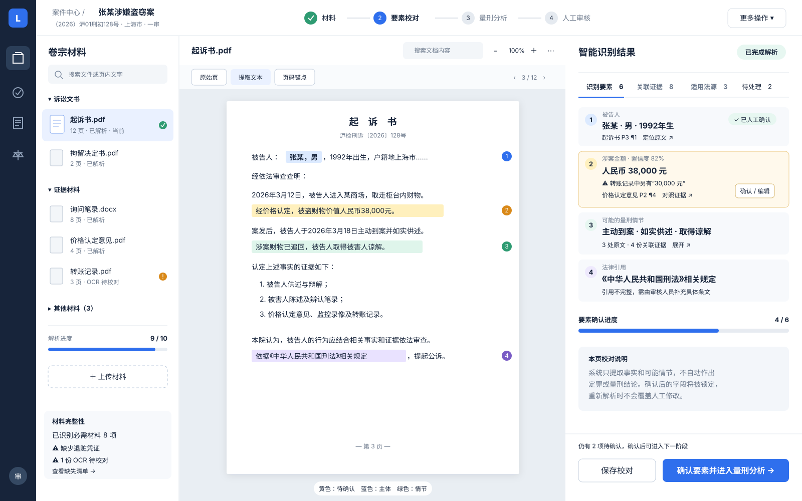
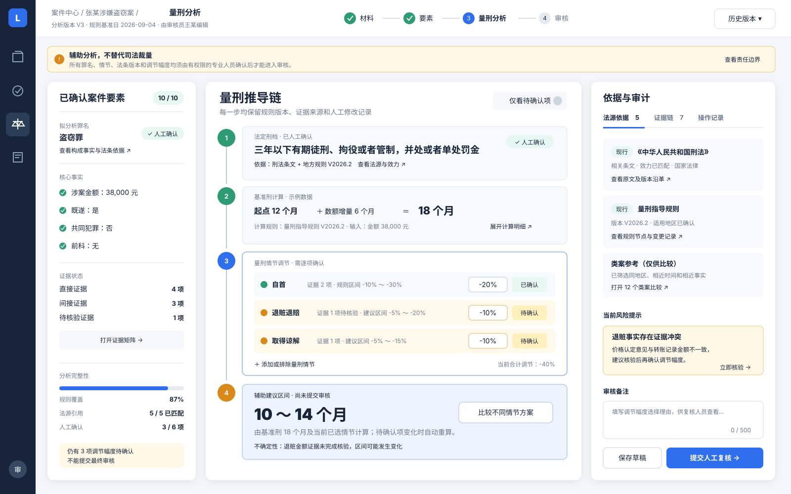
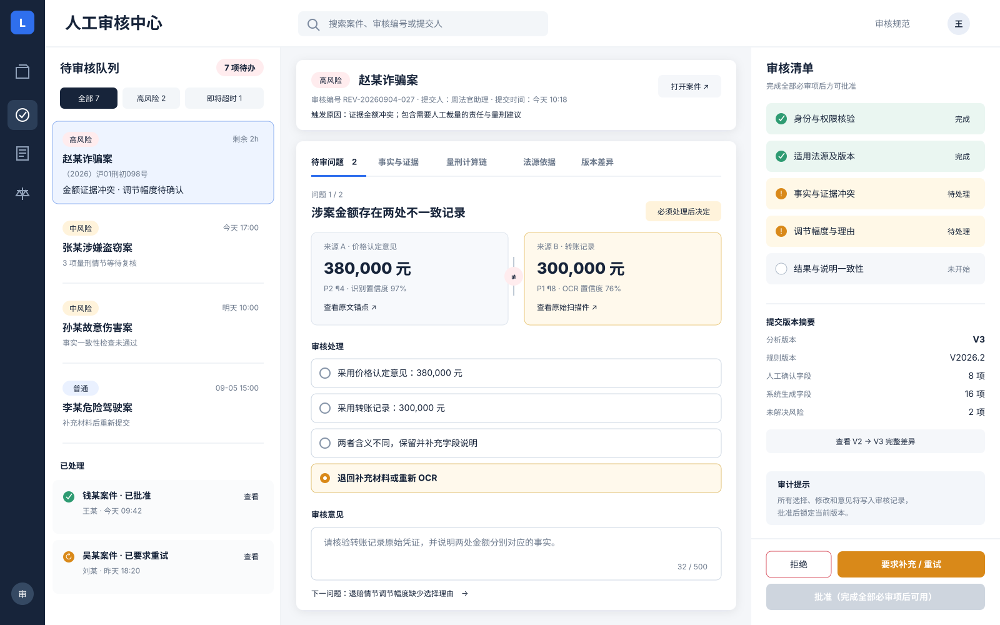
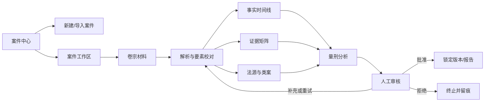

# LexCyber 前端线框图 v0.1

这组图纸面向当前 `lexcyber` 后端能力，采用桌面端优先、人工在环、原文可追溯的设计方向。图中案件和量刑数据均为界面占位示例，不代表真实法律判断或正式量刑规则。

## 图纸索引

### 1. 案件总览

[打开 SVG 原图](./01-case-dashboard.svg)



用途：案件检索、状态筛选、风险提示、今日待办和处理进度。适合作为法官、检察官、律师或审核人员登录后的首页。

### 2. 卷宗分析工作台

[打开 SVG 原图](./02-document-workbench.svg)



用途：在同一屏完成材料导航、原文阅读、关键词高亮、页码定位、结构化要素校对和证据核验。布局为：

```text
卷宗材料树 | 原始文档 / 提取文本 | 识别要素 / 证据 / 法源 / 待处理问题
```

人工确认后的字段应进入锁定状态，重新解析时不得静默覆盖。

### 3. 量刑分析工作台

[打开 SVG 原图](./03-sentencing-analysis.svg)



用途：将结果展示为可检查的推导链，而不是只输出一个刑期数字：

```text
已确认案件要素
→ 法定刑档
→ 基准刑计算
→ 量刑情节逐项调节
→ 辅助建议区间
→ 人工复核
```

每个节点同时展示规则版本、事实输入、证据来源、法源效力和人工选择理由。

### 4. 人工审核中心

[打开 SVG 原图](./04-human-review.svg)



用途：处理 `approve`、`reject`、`request-retry` 三类审核决定。重点呈现冲突来源并排对照、必审清单、版本差异、审核意见和审计提示。

## 推荐信息架构



全局一级导航建议保持在 5～6 项：

1. 案件中心
2. 待办审核
3. 法源知识库
4. 量刑规则
5. 统计与审计
6. 系统管理（仅管理员可见）

不要把“AI 对话”作为唯一入口。对话适合作为页面内的辅助工具，案件、材料、证据和审核仍应使用结构化工作台承载。

## 关键交互约定

### 状态颜色

| 颜色 | 含义 | 示例 |
| --- | --- | --- |
| 蓝色 | 当前选择、系统定位 | 当前步骤、原文锚点 |
| 绿色 | 已经人工确认 | 已核验事实、有效法源 |
| 黄色 | 待确认或存在不确定性 | OCR 待校对、证据待核验 |
| 红色 | 高风险或流程阻断 | 冲突未解决、禁止提交 |
| 紫色 | 法源、规则和引用 | 法条锚点、规则版本 |

颜色不能作为唯一状态表达，必须同时提供文字、图标和可访问名称。

### AI 与人工内容

- 系统提取字段显示置信度、来源和生成时间。
- 人工确认字段显示确认人、确认时间和锁定状态。
- 人工修改后保留原值、修改值和修改理由。
- 重跑模型或技能时，默认只更新未确认字段。
- 最终建议区间始终显示“辅助分析，不替代司法裁量”。

### 原文追溯

- 每个事实、情节、证据和法源都提供可点击锚点。
- 点击右侧字段，中央文档自动定位并高亮对应页段。
- 点击原文高亮，右侧反向定位到相应结构化字段。
- 冲突信息采用并排对照，不只显示笼统警告。

## 响应式建议

- `≥ 1440px`：完整三栏工作台，适合正式材料审阅。
- `1024～1439px`：材料树和右侧审核面板可折叠，中央文档保持主区域。
- `< 1024px`：仅支持案件浏览、待办通知和轻量审批；不建议在移动端完成复杂量刑审核。

## 与当前后端的对应关系

| 前端区域 | 当前可连接能力（0.8 / 2026-09-14） | 仍需补充 |
| --- | --- | --- |
| 任务提交与状态 | `/v1/tasks`、状态、`/result`、`/retry` | 任务取消、实时进度 |
| 案件中心 | 列表、新建、工作区、属主 `/v1/cases` | 编辑、归档、正式阅卷提取 |
| 文档上传与解析 | 上传 PDF/DOCX、自动 `document.parse`、轮询 `parseTaskId` | 缩略图、OCR 校对、材料版本管理 |
| 事实 | `GET`/`PUT` facts、`confirm` 锁定 | 从解析结果批量回写、时间线 / 证据矩阵 |
| 法源检索 | 公开入口 `POST /v1/sources/search` 现为 501 | T3 会签后的正式法源库与类案 |
| 量刑推导链 | `sentencing.calculate` 现为 501 | 罪名模型、规则引擎、情节调节、方案比较 |
| 人工审核 | 查询、批准、拒绝（绑定不可变结果版本） | 必审清单、版本差异对照 |
| 审计 | 后端已有部分审计表 | 前端审计查询、导出、权限可见范围 |

## 外部设计参考

下面的产品用于提炼交互模式，不作为视觉复制对象：

- [Caselex / LexisNexis UX 案例](https://thenimaproject.com/work/lexisnexis)：分层筛选、关键词高亮、案件时间线和引用归档。
- [RelativityOne Review Interface 指南](https://help.relativity.com/PDFDownloads/R1_PDF/RelativityOne%20-%20Review%20interface%20quick%20reference%20guide.pdf)：文档列表、中央 Viewer、右侧 Coding/Review 面板、持续高亮和可折叠卡片。
- [Clio Case Management](https://www.clio.com/features/case-management/)：以 Matter 为中心聚合联系人、文档、日程、备注和任务。
- [Harvey Spaces](https://www.harvey.ai/platform/spaces)：Matter Workspace、共享文档库、结构化 Review Table 和协作边界。
- [Harvey 2026 年 1 月产品更新](https://www.harvey.ai/blog/the-brief-january-2026)：统一文档库与分析入口，重跑时保留已经验证的单元格。
- [IBM Carbon 2x Grid](https://carbondesignsystem.com/elements/2x-grid/usage/)：复杂企业界面的网格和上下文侧面板。

## 建议的下一轮图纸

在确认这四张主图后，再继续绘制：

1. 新建案件四步向导
2. 事实时间线与证据矩阵
3. 法源/类案检索与对比
4. 量刑方案 A/B 对比
5. 最终报告预览与导出
6. 规则版本管理后台

