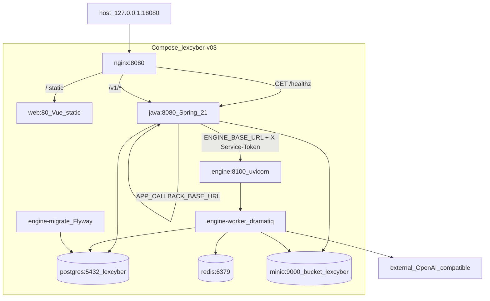
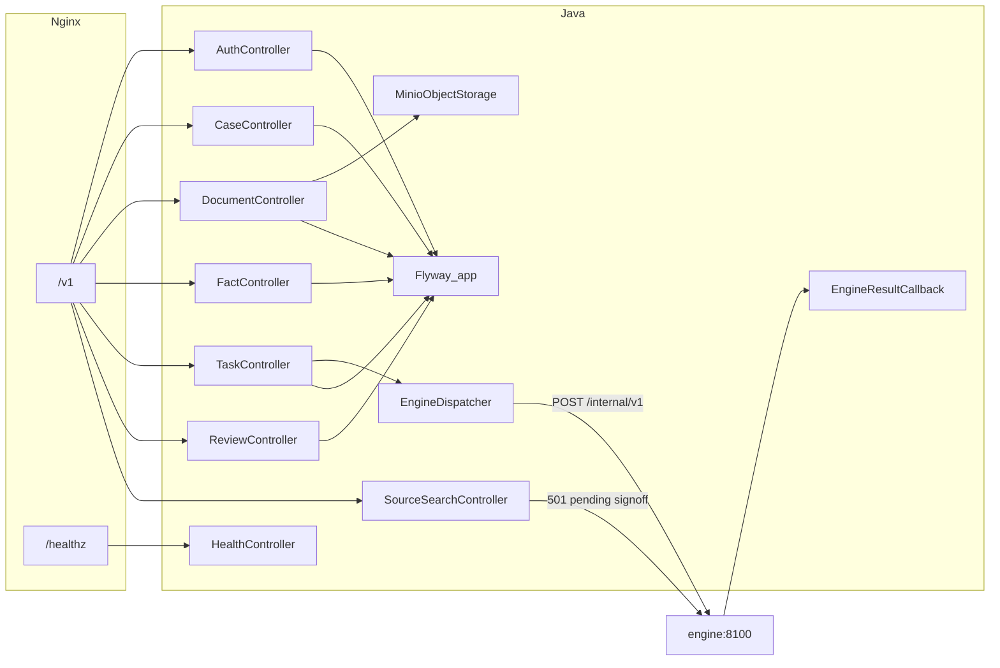
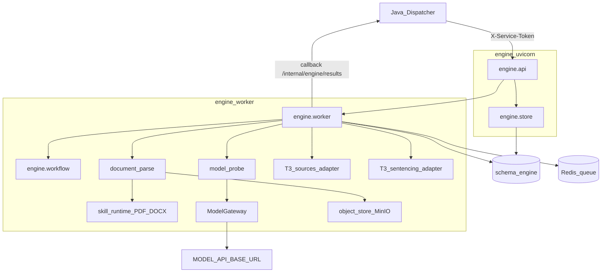
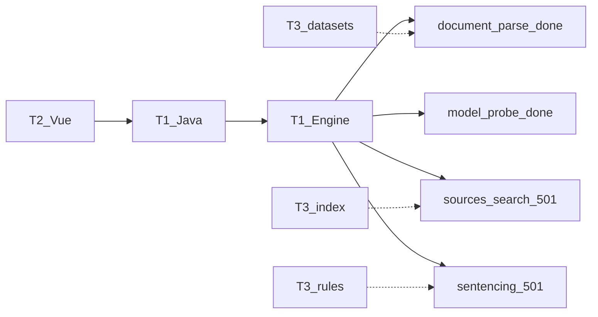
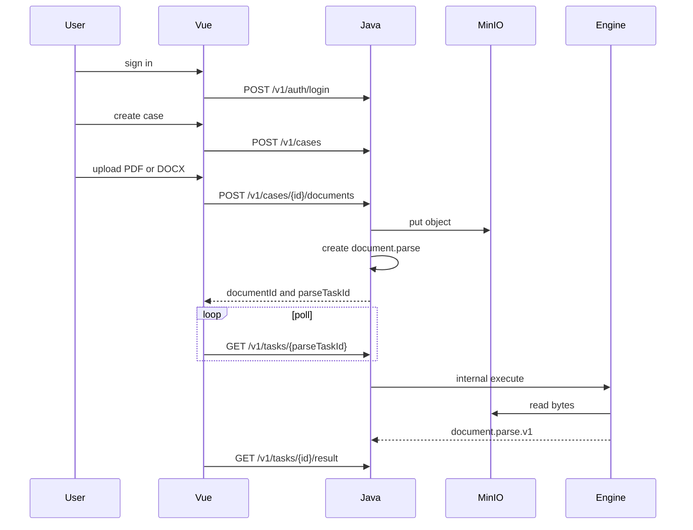
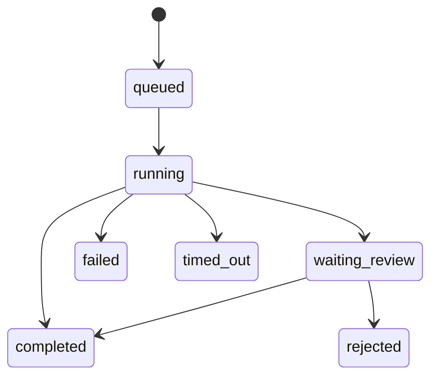

# LexCyber 0.8 product note

[中文](lexcyber-0.8.zh-CN.md) · [README](../README.md)

**Version:** 0.8
**Contract version:** 0.8.0
**Current-state date:** 2026-09-19
**Role:** An auditable task-execution and case-document workbench. It assists review. It does not replace judicial discretion and does not issue sentencing, liability, or crime conclusions.

Open `http://127.0.0.1:18080`. Health check: `GET /healthz` should report `version: 0.8.0` after Java / Engine images are rebuilt.

---

## 1. Main system architecture

Mapped to [`docker-compose.yml`](../docker-compose.yml) and [`nginx/nginx.v03.conf`](../nginx/nginx.v03.conf). Project name `lexcyber-v03`, env file `.env.v03`. The host exposes only `127.0.0.1:18080`. The browser never calls `java:8080`, `engine:8100`, Postgres, Redis, or MinIO.

### 1.1 Deployment and edge



| Service | Image / entry | Role |
| --- | --- | --- |
| `nginx` | `nginx.v03.conf` | `/healthz` and `/v1/` → Java; everything else → `web:80`; 50m upload cap |
| `web` | Vue build | Login, case center, workspace, tasks/reviews |
| `java` | Spring Boot 21, Flyway `app` | Public API, ownership, MinIO writes, Engine dispatch |
| `engine` | `uvicorn engine.run_api_v03:app` | Internal execution API |
| `engine-worker` | `dramatiq engine.run_api_v03` | Queue consumer, parse, probe |
| `engine-migrate` | Flyway → schema `engine` | One-shot migrate |
| `postgres` | DB `lexcyber` | `app` (`lex_app`) and `engine` (`lex_engine`) split users |
| `redis` | AOF | Execution numbers only; no result bodies |
| `minio` | bucket `lexcyber` | Originals; DB stores key / hash / metadata |

### 1.2 Java application

Root package: `com.lexcyber.server`. Public contract [`contracts/public-api.yaml`](../contracts/public-api.yaml) `0.8.0`.



| Area | Types | Public paths |
| --- | --- | --- |
| Identity | `AuthController` / `AuthService` | `/v1/auth/register` `login` `logout` `session` |
| Cases | `CaseService` | `/v1/cases` |
| Documents | `DocumentService` | `/v1/cases/{id}/documents`, `/v1/documents/{id}` |
| Facts | `FactService` | `/v1/cases/{id}/facts`, `.../confirm` |
| Tasks | `TaskService` / `TaskPolicies` | `/v1/tasks`, status, `/result`, `/retry` |
| Reviews | `ReviewService` | `/v1/reviews` (Bearer + owned case; see [t1-api-01-increment.md](t1-api-01-increment.md)) |
| Search gate | `SourceSearchController` / `EngineSourceClient` | `POST /v1/sources/search` → 501 today |
| Engine bridge | `EngineDispatcher`, `EngineResultCallbackController` | Internal HTTP + `X-Service-Token` |

The T3 search and sentencing adapters and `demo_cases/three_case_demo` are present in Engine and included in the image by `engine/Dockerfile` (`COPY demo_cases`). The four public entry points—search, sentencing, `compliance.analyze`, and `conviction.analyze`—remain 501 until signoff is complete. Sentencing also requires both the Java and Engine flags to be enabled; the defaults remain off.

Current public gates: search (`POST /v1/sources/search`) returns `501 SOURCE_SEARCH_UNAVAILABLE`; sentencing task creation (`sentencing.calculate`) returns `501 SENTENCING_UNAVAILABLE`; `compliance.analyze` returns `501 COMPLIANCE_UNAVAILABLE`; `conviction.analyze` returns `501 CONVICTION_UNAVAILABLE`. These response codes remain unchanged until signoff is complete.

`document.parse` and `model.probe` require Bearer. Upload writes MinIO then creates parse and overwrites a client `storageKey`.

### 1.3 Engine internals

Internal contract [`contracts/internal-engine-api.yaml`](../contracts/internal-engine-api.yaml). Default `WORKFLOW_PROFILE=stub`.



| Code | Role |
| --- | --- |
| `engine/api.py` | FastAPI 0.8.0, `/healthz`, accept internal tasks |
| `engine/worker.py` + `workflow.py` | Leases, checkpoints, stub / domain tasks |
| `document_parse.py` | Re-read MinIO bytes; emit `document.parse.v1` |
| `model_probe.py` | External model only via `ModelGateway` |
| `adapters/sources.py` | T3 search adapter; returns `SOURCE_SEARCH_UNAVAILABLE` while the public gate is off |
| `adapters/sentencing.py` | T3 sentencing adapter; returns `SENTENCING_UNAVAILABLE` while the public gate is off |
| `engine/migrations` | Flyway `engine` schema |
---

## 2. Team tracks and wiring

Mapped to `技术分工0906.md` (local file; do not commit).



| Track | Status in 0.8 |
| --- | --- |
| T1 | **On `main`.** Cases/documents/auto-parse, facts, reserved-task auth, `storageKey` bind, real `model.probe` |
| T2 | **Merged into local `main`.** The case-center list/create/upload/workspace parse/facts path, formal document-review, sentencing, and source-law pages, and review archiving are wired; compliance/conviction pages expose module content, and conviction shows jurisdictional connections, baseline position, and missing items |
| T3 | **Internal capability is in place.** The T3 search/sentencing adapters and `demo_cases/three_case_demo` are present in Engine and the image; public search, sentencing, compliance, and conviction analysis entry points remain behind the signoff gate and return 501 |

Public contract: [`contracts/public-api.yaml`](../contracts/public-api.yaml) (`info.version: 0.8.0`). Internal: [`contracts/internal-engine-api.yaml`](../contracts/internal-engine-api.yaml).

---

## 3. Case path

Upload creates `document.parse`. T2 only polls `parseTaskId` and reads body text from `/v1/tasks/{id}/result`. Do not create a second parse task. Do not send `storageKey`.



Task states:



A review is bound to one immutable result version. Approve does not rerun the worker. Retry starts a new execution and keeps the old result.

---

## 4. Local start

```powershell
Copy-Item .env.v03.example .env.v03
docker compose --env-file .env.v03 up --build
curl.exe http://127.0.0.1:18080/healthz
```

Default `WORKFLOW_PROFILE=stub` still accepts a caseless stub task with no session. A real `model.probe` needs `MODEL_*` in `.env.v03`. Credentials stay in process env:

```powershell
$env:LEXCYBER_USERNAME = "<local username>"
$env:LEXCYBER_PASSWORD = "<local password>"
python scripts/t1_local_closeout.py
```

Samples: [`LexCyber_T1接口交接样例.md`](../LexCyber_T1接口交接样例.md). Do not commit `.env.v03` or API keys.

---

## 5. Do not

1. Call Engine, MinIO, or a vector store from the browser
2. Serve `retrieval/corpus.py` sample articles as public search hits
3. Treat unconfirmed sentencing ratios as production rules
4. Show placeholder “Lin” excerpts as real parse or sentence output

Public retrieval remains pending legal signoff: [`t1-retrieval-boundary.md`](t1-retrieval-boundary.md).
