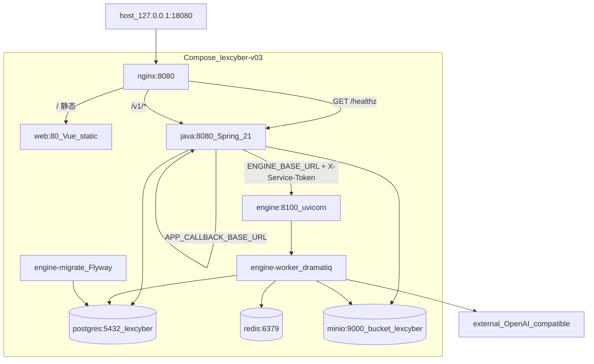
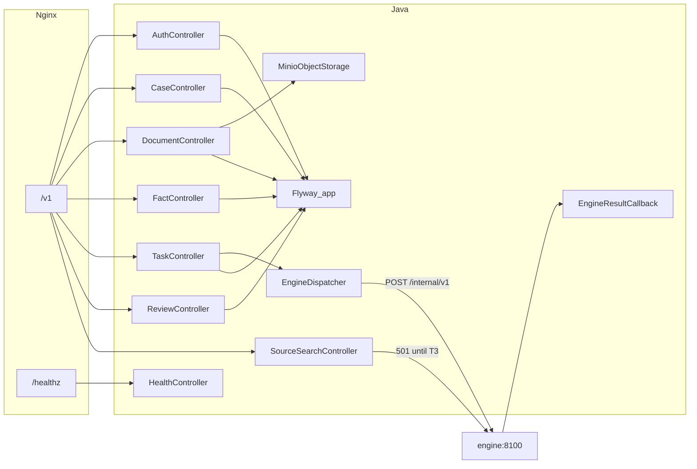
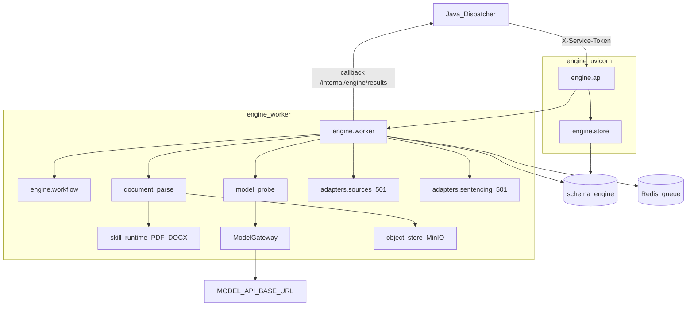
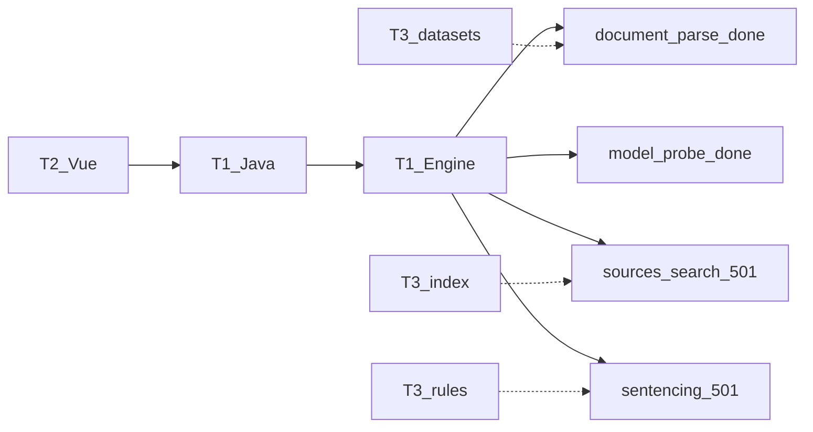
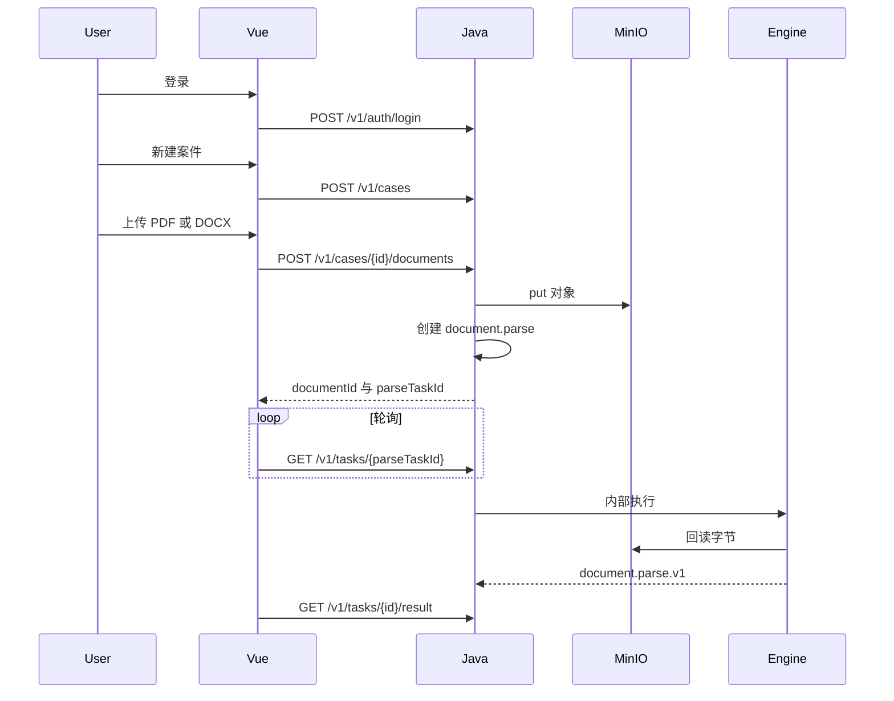
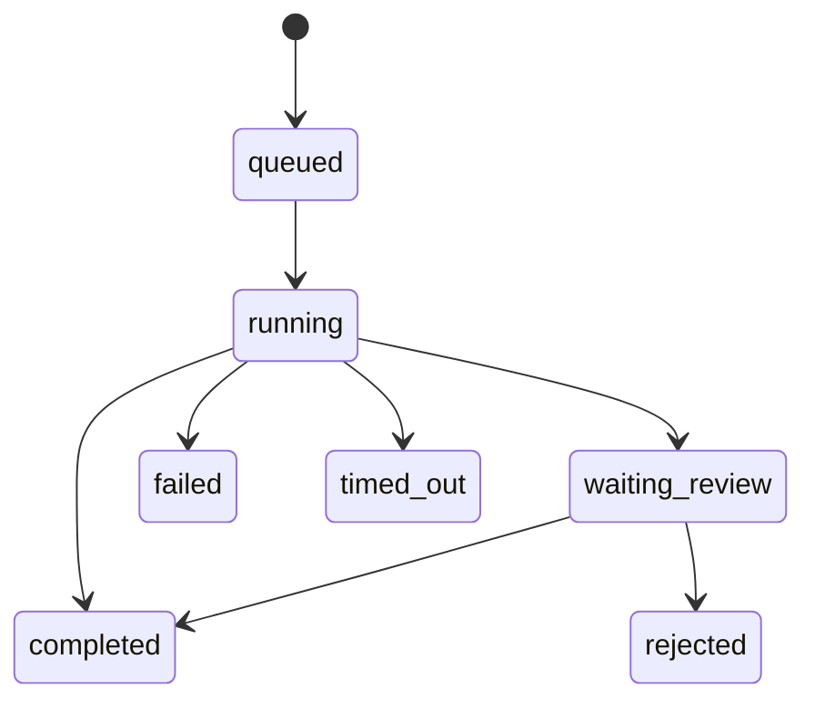

# LexCyber 0.8 产品说明

[English](lexcyber-0.8.en.md) · [README](../README.md)

**版本：** 0.8  
**定位：** 可审计的任务执行与案件材料工作台。辅助研判，不替代司法裁量；不作出量刑、责任或犯罪结论。

打开 `http://127.0.0.1:18080`。健康检查：`GET /healthz` 应为 `version: 0.8.0`（需重建 Java / Engine 镜像）。

---

## 1. 主系统架构

对照 [`docker-compose.yml`](../docker-compose.yml) 与 [`nginx/nginx.v03.conf`](../nginx/nginx.v03.conf)。工程名 `lexcyber-v03`，环境文件 `.env.v03`。宿主机只暴露 `127.0.0.1:18080`。浏览器不直连 `java:8080`、`engine:8100`、Postgres、Redis、MinIO。

### 1.1 部署与入口



| 服务 | 镜像/入口 | 作用 |
| --- | --- | --- |
| `nginx` | `nginx.v03.conf` | `/healthz`、`/v1/` → Java；其余 → `web:80`；上传上限 50m |
| `web` | Vue 构建产物 | 登录、案件中心、工作区、任务/复核 |
| `java` | Spring Boot 21，Flyway `app` | 公开 API、属主、MinIO 写入、派发 Engine |
| `engine` | `uvicorn engine.run_api_v03:app` | 内部执行 API |
| `engine-worker` | `dramatiq engine.run_api_v03` | 队列消费、解析、probe |
| `engine-migrate` | Flyway → schema `engine` | 一次性迁移 |
| `postgres` | 库 `lexcyber` | `app`（`lex_app`）与 `engine`（`lex_engine`）分账号 |
| `redis` | AOF | 只传执行号，不存结果正文 |
| `minio` | bucket `lexcyber` | 原文；库里只存 key / hash / 元数据 |

### 1.2 Java 应用内部

包根：`com.lexcyber.server`。公开契约 [`contracts/public-api.yaml`](../contracts/public-api.yaml) `0.8.0`。



| 模块 | 类 | 公开路径 |
| --- | --- | --- |
| 身份 | `AuthController` / `AuthService` | `/v1/auth/register` `login` `logout` `session` |
| 案件 | `CaseService` | `/v1/cases` |
| 材料 | `DocumentService` | `/v1/cases/{id}/documents`、`/v1/documents/{id}` |
| 事实 | `FactService` | `/v1/cases/{id}/facts`、`.../confirm` |
| 任务 | `TaskService` / `TaskPolicies` | `/v1/tasks`、状态、`/result`、`/retry` |
| 复核 | `ReviewService` | `/v1/reviews`（Bearer + 属主案件；见 [t1-api-01-increment.md](t1-api-01-increment.md)） |
| 检索门 | `SourceSearchController` / `EngineSourceClient` | `POST /v1/sources/search` → 现 501 |
| 引擎桥 | `EngineDispatcher`、回调 `EngineResultCallbackController` | 内部 HTTP + `X-Service-Token` |

`document.parse` / `model.probe` 必须 Bearer。上传写 MinIO 后建解析任务，覆盖客户端 `storageKey`。

### 1.3 Engine 内部

内部契约 [`contracts/internal-engine-api.yaml`](../contracts/internal-engine-api.yaml)。默认 `WORKFLOW_PROFILE=stub`。



| 代码 | 作用 |
| --- | --- |
| `engine/api.py` | FastAPI 0.8.0，`/healthz`，接内部任务 |
| `engine/worker.py` + `workflow.py` | 租约、checkpoint、stub / 领域任务 |
| `document_parse.py` | 从 MinIO 回读，产出 `document.parse.v1` |
| `model_probe.py` | 只经 `ModelGateway` 调外部模型 |
| `adapters/sources.py` | `SOURCE_SEARCH_UNAVAILABLE` |
| `adapters/sentencing.py` | `SENTENCING_UNAVAILABLE` |
| `engine/migrations` | Flyway `engine` schema |
---

## 2. 团队分工与接通状态

对照 `技术分工0906.md`（本机文件，勿提交）。



| 轨道 | 0.8 状态 |
| --- | --- |
| T1 | **已合入。** 案件/材料/自动解析、facts、保留任务鉴权、`storageKey` 绑定、真实 `model.probe` |
| T2 | **主路径已合入。** 四入口、列表/新建/上传/工作区解析/facts。阅卷/量刑正式页显示「未接通」 |
| T3 | **未做。** 无 `datasets/`；检索与量刑 adapter 返回 501 |

公开契约：[`contracts/public-api.yaml`](../contracts/public-api.yaml)（`info.version: 0.8.0`）。内部：[`contracts/internal-engine-api.yaml`](../contracts/internal-engine-api.yaml)。

---

## 3. 案件主路径

上传即建 `document.parse`。T2 只轮询 `parseTaskId`，从 `/v1/tasks/{id}/result` 读正文。不要再 `POST /v1/tasks` 建解析，不要传 `storageKey`。



任务状态：



复核绑定不可变结果版本。批准不重跑 worker。重试会开新执行，旧结果保留。

---

## 4. 本机启动

```powershell
Copy-Item .env.v03.example .env.v03
docker compose --env-file .env.v03 up --build
curl.exe http://127.0.0.1:18080/healthz
```

默认 `WORKFLOW_PROFILE=stub`，无会话也可提交普通 stub 任务。真实 `model.probe` 需要 `.env.v03` 里的 `MODEL_*`，口令只走环境变量：

```powershell
$env:LEXCYBER_USERNAME = "<local username>"
$env:LEXCYBER_PASSWORD = "<local password>"
python scripts/t1_local_closeout.py
```

样例见 [`LexCyber_T1接口交接样例.md`](../LexCyber_T1接口交接样例.md)。不要提交 `.env.v03` 或 API key。

---

## 5. 明确不做

1. 浏览器直连 Engine / MinIO / 向量库  
2. 把 `retrieval/corpus.py` 样例条文当公开检索结果  
3. 未经法学确认的量刑比例当正式规则  
4. 正式页用占位「林某」冒充真实解析或刑期  

检索边界仍待 T3 会签：[`t1-retrieval-boundary.md`](t1-retrieval-boundary.md)。
